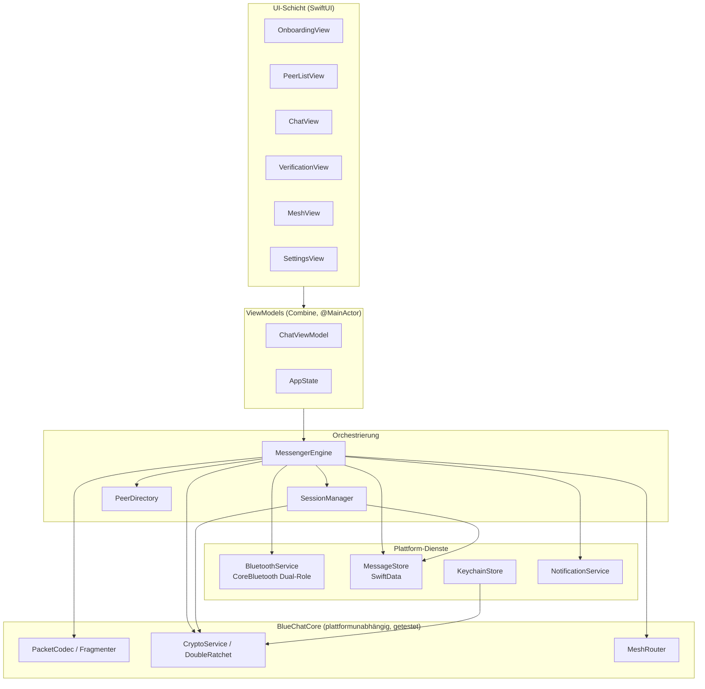
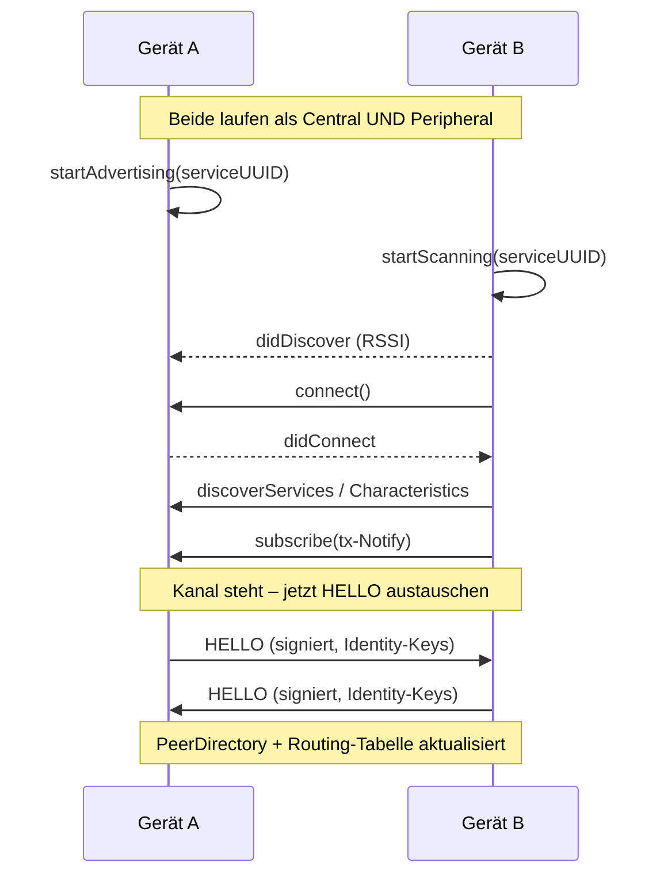
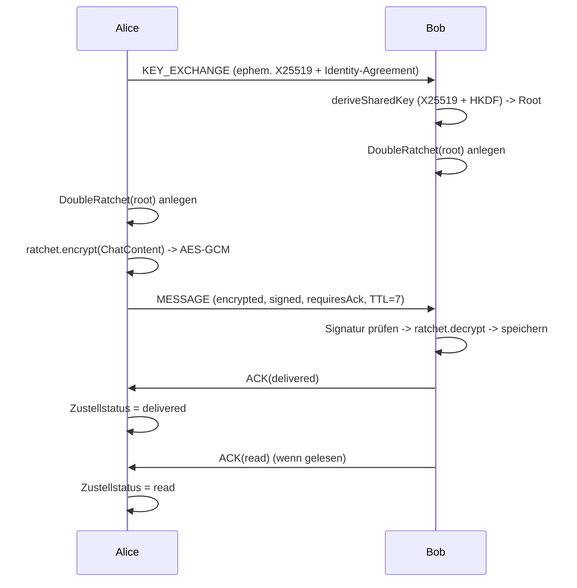
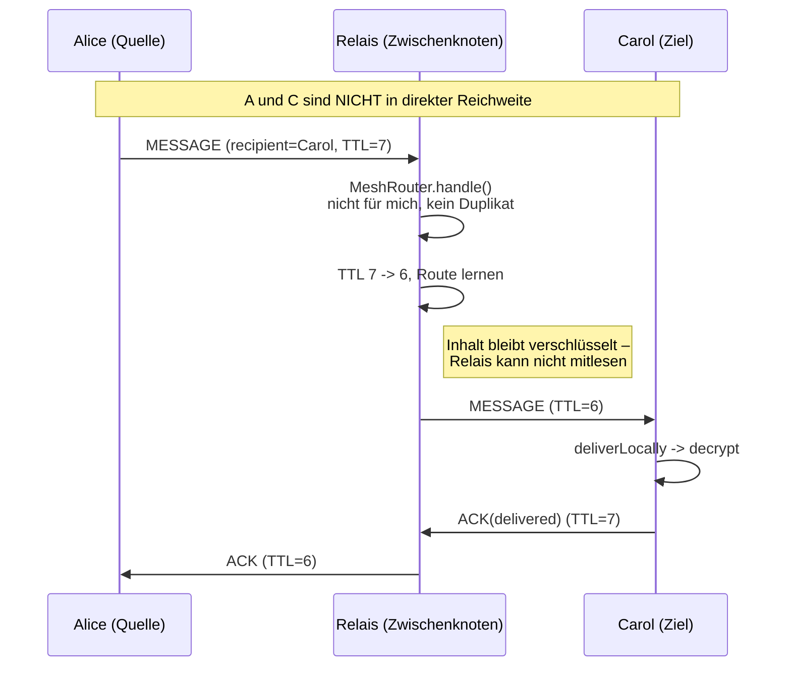
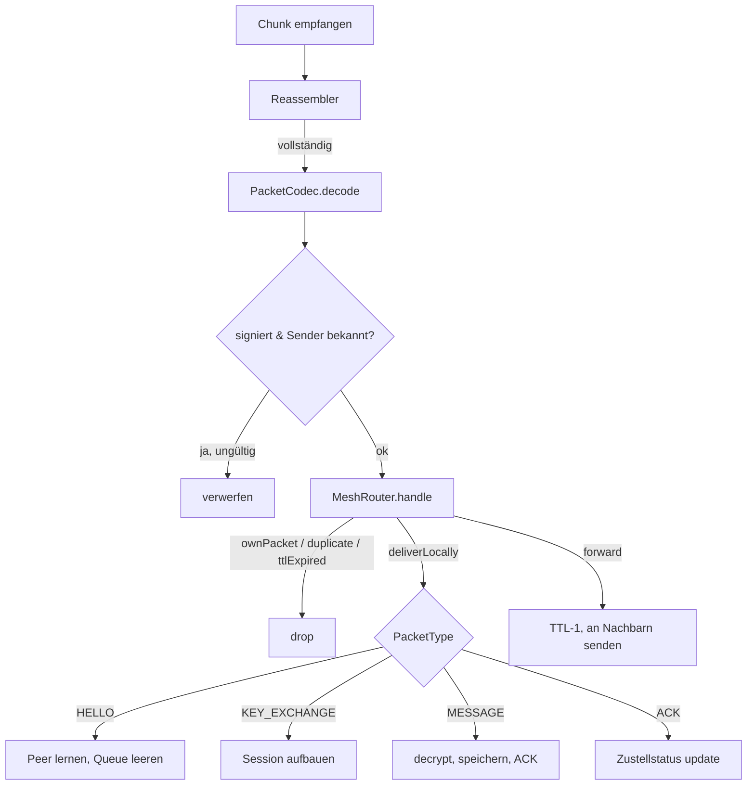

# BlueChat – Architektur- & Sequenzdiagramme

> Diagramme in [Mermaid](https://mermaid.js.org). GitHub rendert sie direkt.

## 1. Schichtenarchitektur (MVVM + Core)

## 2. Discovery & Verbindungsaufbau (Dual-Role)

## 3. Schlüsselaustausch & verschlüsselte Nachricht

## 4. Mesh-Multi-Hop-Weiterleitung

## 5. Eingehender Paketfluss (Entscheidungsbaum)

